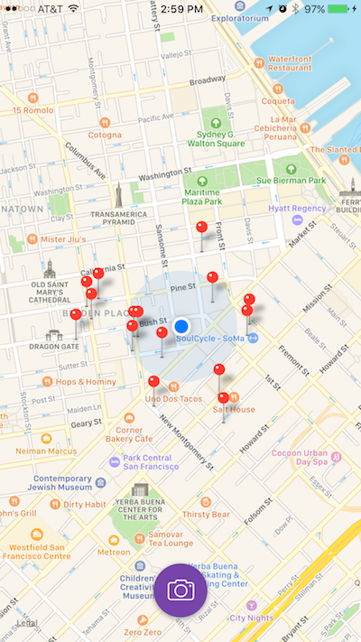
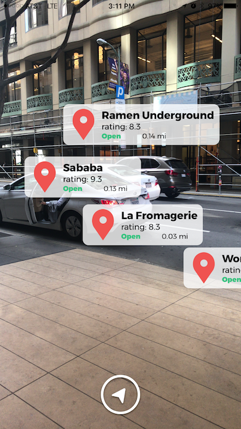
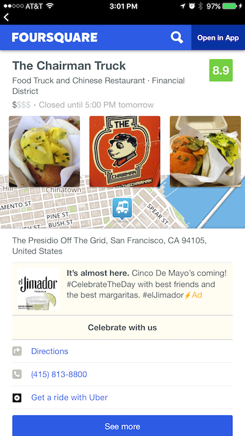

# ScoutAR
Augmented reality app displays nearby restaurant information in a live camera and map view.
##### Download from the [App Store](https://itunes.apple.com/us/app/scout-ar/id1233445898?mt=8).

## Features
* The user can view nearby restaurants on a map view.
* Tap the camera button to be taken to the augmented reality view where the user can use their camera to display annotations with restaurant information. Move the phone around until facing the direction of a venue for the annotation to appear on the screen.
* Tap an annotation to segue to a page with restaurant details.
* See further details on Foursquare's website via a web view.

### Issues
* Slight lag when loading pictures in the collection view of the restaurant detail page.
* Annotations may overlap one another if the restaurant name is very long.

### Screenshots
#### Map View

#### Augmented Reality View

#### Restaurant Detail View

#### Foursquare Web View

See the original repo here: [https://github.com/ellatronic/ARFoodFinder](https://github.com/ellatronic/ARFoodFinder).
